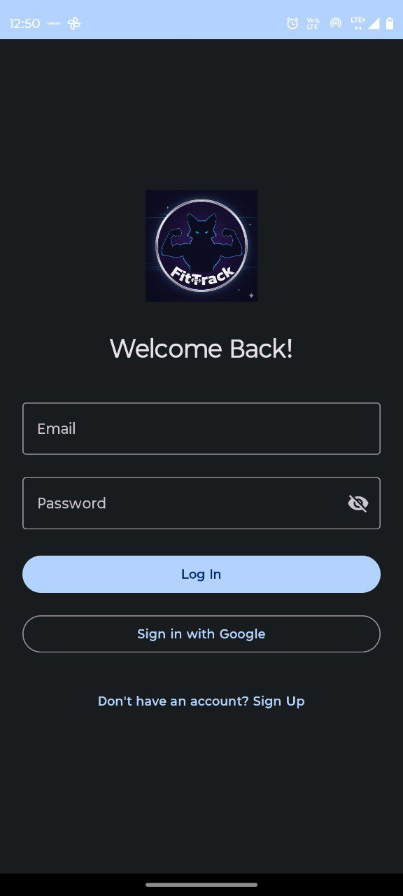
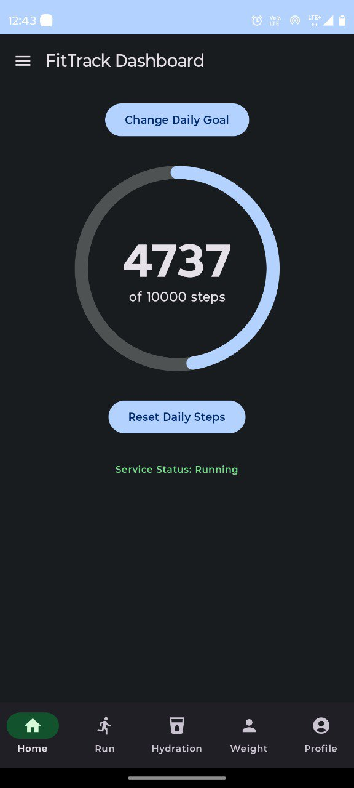
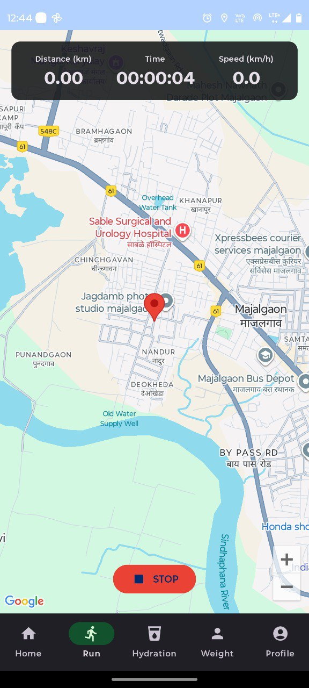
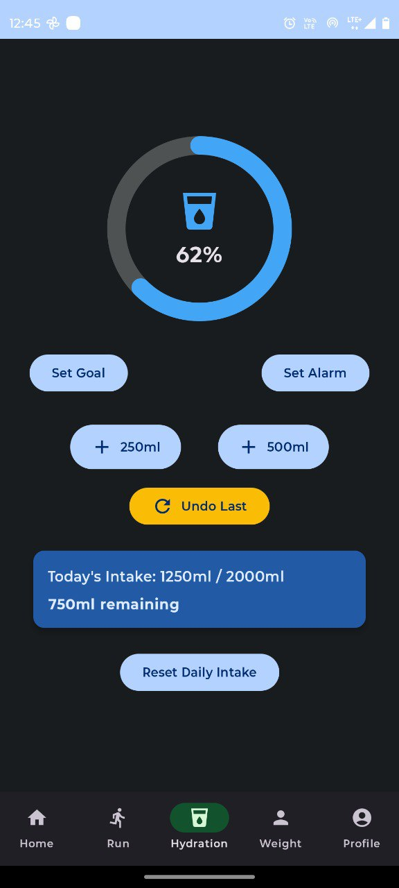
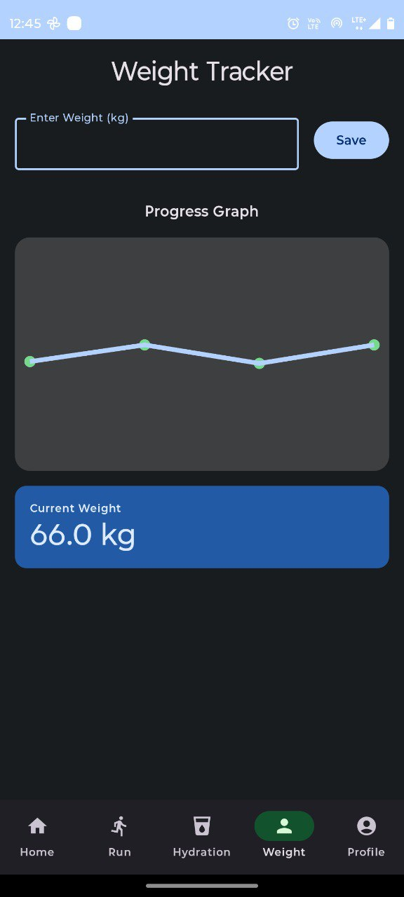
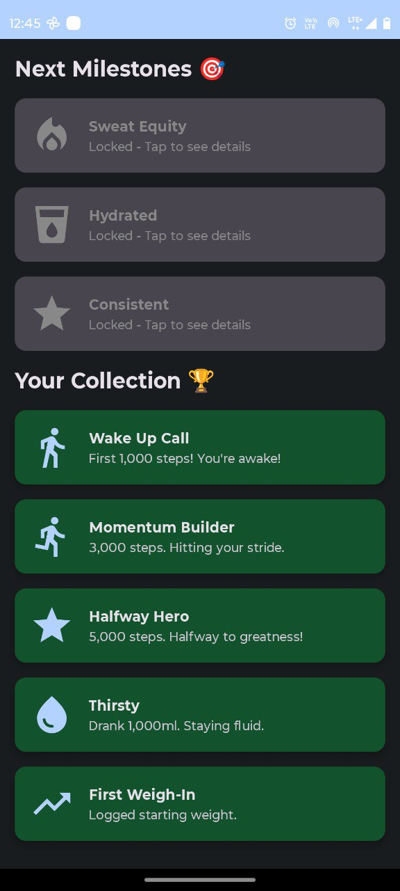

# Fitness Tracker App 🏃‍♂️💪

A comprehensive mobile fitness tracking application designed to help users monitor their health, track workouts, and stay motivated through gamification and detailed analytics.

## 🚀 Features

This app includes a wide range of features to cover all aspects of your daily fitness routine:

* **🔐 Login & Authentication:** Secure onboarding and login system for users.
* **👣 Steps Counting Dashboard:** Real-time pedometer integration to track daily steps and activity levels.
* **📍 Running Map Tracking:** GPS-enabled map interface to track running routes, distance, and speed.
* **💧 Hydration Tracking:** Log daily water intake to ensure you stay hydrated throughout the day.
* **⚖️ Weight Tracker:** Monitor weight goals and history with easy-to-read progress charts.
* **👤 User Profile:** Manage personal details, body metrics, and fitness preferences.
* **🏆 Achievements:** Earn badges and unlock milestones to stay motivated.

## 📸 Screenshots

| Login Page | Steps Dashboard | Running Map |
|:---:|:---:|:---:|
|  |  |  |

| Hydration Tracker | Weight Tracker | Profile |
|:---:|:---:|:---:|
|  |  |  |

| Achievements | | |
|:---:|:---:|:---:|
|  | | |

* **Language:** Kotlin
* **UI Toolkit:** Jetpack Compose
* **Authentication:** Firebase Authentication
* **Database:** Firebase Realtime Database / Cloud Firestore
* **Architecture:** MVVM (Model-View-ViewModel)
* **Maps:** Google Maps SDK for Android

## 📥 Installation

1.  **Clone the repository:**
    ```bash
    git clone [https://github.com/ghodkevrushabh/fitness-tracker-app.git](https://github.com/ghodkevrushabh/fitness-tracker-app.git)
    ```
2.  **Open in Android Studio:**
    * Open Android Studio.
    * Select **File > Open** and navigate to the cloned directory.

3.  **Firebase Setup:**
    * Create a project in the [Firebase Console](https://console.firebase.google.com/).
    * Add an Android app to your Firebase project using the package name (found in `AndroidManifest.xml` or `build.gradle`).
    * Download the `google-services.json` file.
    * Place `google-services.json` in the `app/` folder of the project.

4.  **Build and Run:**
    * Let Gradle sync completely.
    * Connect a physical device or start an emulator.
    * Click the **Run** button (green arrow) in Android Studio.

## 🤝 Contributing

Contributions are welcome! Please fork the repository and submit a pull request for any improvements or bug fixes.
